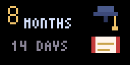

# Tronbyt Apps

Free apps for [Tronbyt](https://github.com/tronbyt/server) and compatible Tidbyt displays.

## Visual Countdown

Count down to an event with a large remaining-time value, the event name, and an original pixel-art scene.

| Birthday | Travel | Holiday |
| --- | --- | --- |
|  |  |  |

| Launch | Wedding | Summer |
| --- | --- | --- |
|  |  |  |

| Work | Graduation | Baby | Home |
| --- | --- | --- | --- |
|  |  |  |  |

Themes: celebration (the default), birthday, travel, summer, holiday, launch, wedding, work, graduation, baby, and home.

Choose the event name and date, optionally count down to an exact time, and personalize the display with a theme and custom colors. Your location keeps the countdown aligned with your local date and time.

Display the remaining time automatically or in days, weeks, months, years, months + days, or years + months + days. Calendar-based modes account for the actual length of each month and year.

Supports **64×32** and **128×64** displays.

## Visual Commute

Show how long it takes to get from one place to another, with a large travel time and an original pixel-art scene.

| Drive | Walk | Bike | Transit |
| --- | --- | --- | --- |
|  |  |  |  |

Pick a start and end, name them (for example HOME and WORK), and choose drive, walk, bike, or transit. Driving can show extra minutes when traffic is worse than usual.

You add your own Google Routes API key. Enable the Routes API on a Google Cloud key and paste it into the app. Unused space stays black.

Supports **64×32** and **128×64** displays.

## Use it

Anyone can use this. It is licensed under [Apache License 2.0](LICENSE).

### On Tronbyt

1. Open Tronbyt Manager as an administrator.
2. Set **Custom App Repo** to `https://github.com/ethangyn/tronbyt-apps.git`
3. Refresh the app list. Leave the main system app repo as it is.
4. On your device, add **Visual Countdown** or **Visual Commute**.
5. For Visual Countdown, enter an event name and date, pick a theme, and save. For Visual Commute, set the two places, travel mode, and your Google Routes API key.

If the app does not appear, refresh the custom app repo again.

### On your computer

Install [Pixlet](https://github.com/tronbyt/pixlet/releases/latest) and put it on your `PATH`. This repository targets Pixlet v0.53.1.

```
pixlet serve apps/visualcountdown/visual_countdown.star
pixlet serve apps/visualcommute/visual_commute.star
```

Open [http://localhost:8080](http://localhost:8080). Examples:

```
http://localhost:8080/?event_name=JAPAN&event_time=2026-12-09&theme=travel&mode=days
http://localhost:8080/?mode=drive&from_label=HOME&to_label=WORK&demo_seconds=1380
```

```
pixlet render apps/visualcountdown/visual_countdown.star event_name="JAPAN" event_time="2026-12-09" theme=travel
pixlet check apps/visualcountdown
pixlet check apps/visualcommute
```

When using Pixlet directly, settings are passed as query parameters or render arguments. Date-only countdown values such as `2026-12-09` use that calendar day in the configured timezone. Event names are limited to 32 characters. `demo_seconds` is only for local commute previews.

Each app lives in `apps/<name>/` with a `manifest.yaml`, Starlark source, and preview images — the same layout as [tronbyt/apps](https://github.com/tronbyt/apps).

## Contributing

See [CONTRIBUTING.md](CONTRIBUTING.md).

## License

[Apache License 2.0](LICENSE)
